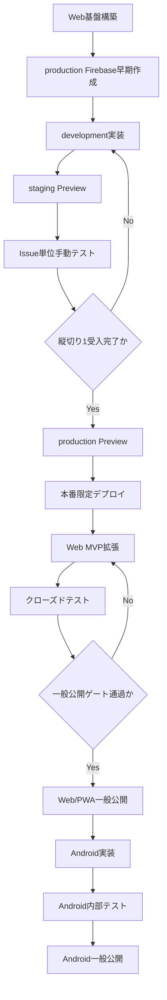
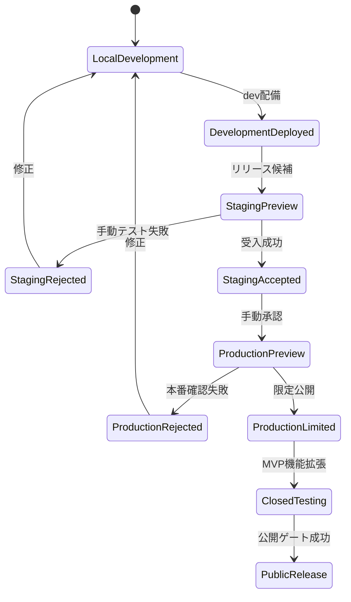

# 本番環境・デプロイ設計

## 結論

本番環境は、実装終盤ではなく Web 版の基盤構築直後に早期作成する。

ただし、次は明確に分ける。

```text
本番環境を早く作る
≠
一般公開を早く行う
```

基本方針:

```text
実装初期
→ production 用 Firebase プロジェクトと Hosting を作成

最初の縦切り完成
→ 本番環境へ限定デプロイ

Web MVP 完成
→ クローズド公開

公開要件完了
→ 一般公開
```

Firebase 環境は、development / staging / production を別 Firebase プロジェクトとして分離する。

## 要件定義への追加

### REQ-DEPLOY-001 環境分離

Firebase 環境を次の 3 つに分離する。

| 環境 | 用途 |
|---|---|
| development | 日常開発、機能実装 |
| staging | リリース候補の結合・手動テスト |
| production | 本番相当動作、限定公開、一般公開 |

各環境は別 Firebase プロジェクトとする。

```text
training-ai-dev
training-ai-stg
training-ai-prod
```

### REQ-DEPLOY-002 本番環境の作成時期

production 環境は、Epic 1「Web 基盤」の中で作成する。

作成時期は次の Issue より後、認証実装より前を基準とする。

```text
Flutter Web プロジェクト初期化
↓
dev/stg/prod 環境切替基盤
↓
production Firebase プロジェクト作成
↓
Firebase Web アプリ登録
↓
Authentication・Firestore・Hosting 初期化
```

実装終盤まで production 環境の作成を遅らせない。

### REQ-DEPLOY-003 初期構築対象

production 環境の早期構築時に、次を準備する。

- Firebase プロジェクト
- Firebase Web アプリ
- Cloud Firestore
- Firebase Authentication
- Google ログインプロバイダー
- Email/Password プロバイダー
- Firebase Hosting
- Firestore Security Rules 初期版
- Firestore Indexes 設定ファイル
- Cloud Functions 配備先
- App Check 設定枠
- 使用量・予算アラート
- 本番用ドメインまたは Hosting URL

### REQ-DEPLOY-004 本番データの利用制限

一般公開前の production 環境は、開発者および許可したテスターだけが利用する。

production 環境で利用するテストアカウントは、本番確認専用とする。

次は禁止する。

- development 用ダミーデータの投入
- Security Rules を緩めたままの配備
- 本番管理者鍵のクライアント同梱
- development Firebase 設定で production をビルド
- production データをローカル開発で自由に変更

### REQ-DEPLOY-005 本番限定デプロイの時期

最初の Web 縦切りが staging で完成した時点で、production へ限定デプロイする。

対象フロー:

```text
ログイン
↓
初回プロフィール
↓
腕立て伏せ1セット入力
↓
Cloud Firestore保存
↓
推定負荷・ボリューム表示
↓
AI Markdown生成
↓
AI出力履歴保存
```

この段階では一般公開しない。

目的は次の本番固有問題を早期発見すること。

- Google ログインの承認ドメイン
- 本番 Firebase 設定
- Hosting ルーティング
- Security Rules
- Firestore Indexes
- PWA キャッシュ
- production ビルドからの Functions 呼び出し
- 本番環境でのアカウント削除

## 本番デプロイ段階

### Stage 0: 本番環境作成

時期:

```text
Web 基盤構築直後
```

実施:

- production Firebase プロジェクト作成
- Web アプリ登録
- Authentication 有効化
- Firestore 作成
- Hosting 初期化
- 本番用設定ファイル生成
- 空の初期ページまたはメンテナンスページ配備

この時点ではアプリ機能を公開しない。

### Stage 1: 本番接続確認

時期:

```text
認証基盤と Firestore Repository 完成後
```

確認:

- production ビルドが production Firebase へ接続する
- staging ビルドが production へ接続しない
- Google ログインできる
- Email/Password 登録できる
- 他ユーザーの Firestore データを取得できない
- Hosting の直接 URL アクセスで 404 にならない

### Stage 2: 最初の縦切り限定デプロイ

時期:

```text
Web 縦切り 1 が staging で受入完了後
```

公開範囲:

- 開発者本人
- 許可したテスター
- URL 非告知
- production 用テストアカウント

この時点で production の実データ保存を確認する。

### Stage 3: クローズドテスト

Web 版で以下が完成後に実施する。

- 複数セット
- 外部重量
- 履歴
- 比較
- AI 出力履歴
- 次回予定
- 計算設定
- JSON エクスポート
- アカウント削除
- PWA 基本動作

### Stage 4: 一般公開

次がすべて完了した時点で一般公開する。

- 全 MVP Issue 完了
- 各 Issue の手動テスト結果記録済み
- Security Rules 拒否系テスト完了
- アカウント削除確認
- プライバシーポリシー
- 利用規約
- 問い合わせ先
- Firebase 予算アラート
- production デバッグ機能非搭載
- 重大なデータ消失不具合なし

## デプロイの実行順序

### staging 配備順

```text
1. Firestore Indexes
2. Firestore Security Rules
3. Cloud Functions
4. Flutter Web build
5. Firebase Hosting Preview Channel
6. 手動テスト
7. staging live
```

### production 配備順

```text
1. Firestore Indexes
2. 後方互換性のある Security Rules
3. Cloud Functions
4. production Web build
5. production Preview Channel
6. 本番用テストアカウントで確認
7. Hosting live へ反映
```

クライアントより前に、必要な Rules・Indexes・Functions を配備する。

ただし新しい Rules が旧クライアントを破壊する場合は、次の二段階にする。

```text
互換 Rules 配備
↓
新クライアント配備
↓
移行確認
↓
旧仕様を削除する Rules 配備
```

## Flutter Web ビルド

production ビルド例:

```bash
flutter build web \
  --release \
  --dart-define=APP_ENV=production
```

Flutter Web のリリース成果物は通常 `build/web` へ生成される。

環境別エントリーポイントを使う場合:

```text
lib/main_dev.dart
lib/main_stg.dart
lib/main_prod.dart
```

または、共通 `main.dart` と `--dart-define` で切り替える。

MVP では設定漏れを防ぐため、環境別エントリーポイントを推奨する。

## Firebase CLI 構成

`.firebaserc` 例:

```json
{
  "projects": {
    "dev": "training-ai-dev",
    "stg": "training-ai-stg",
    "prod": "training-ai-prod"
  }
}
```

配備時は必ず対象を明示する。

```bash
firebase deploy --project training-ai-stg
```

```bash
firebase deploy --project training-ai-prod
```

`firebase use` だけに依存せず、CI と手動配備の双方で `--project` を指定する。

## Preview Channel

staging 候補:

```bash
firebase hosting:channel:deploy release-candidate \
  --project training-ai-stg
```

production 候補:

```bash
firebase hosting:channel:deploy prod-candidate \
  --project training-ai-prod
```

Preview Channel 上で次を確認する。

- Google ログイン
- メールログイン
- URL 再読み込み
- 直接 URL アクセス
- Firestore 保存
- Security Rules
- PWA Manifest
- コピー
- AI 履歴保存
- アカウント削除
- ブラウザコンソールエラー

## Issue 受け入れ要件への追加

本番または staging 配備に関係する Issue には、以下を追加する。

```md
## デプロイ確認

- [ ] development環境で確認した
- [ ] staging環境へデプロイした
- [ ] stagingの実URLで手動テストした
- [ ] Firebase接続先がstagingであることを確認した
- [ ] Firestore Security Rulesが期待どおり動作した
- [ ] ブラウザコンソールに未対応エラーがない
- [ ] production影響の有無を確認した
```

production 対象 Issue ではさらに追加する。

```md
- [ ] production Preview Channelへデプロイした
- [ ] production用テストアカウントで確認した
- [ ] production Firebaseへ接続していることを確認した
- [ ] development/staging用表示が含まれていない
- [ ] Developer Toolsルートが存在しない
- [ ] Security Rules・Indexes・Functionsを先に配備した
- [ ] ロールバック対象バージョンを確認した
- [ ] 本番手動テスト結果をIssueまたはPRへ記録した
```

## デプロイ関連 Issue

### Epic 1: 環境・本番基盤

1. Flutter Web プロジェクトを初期化する
2. dev/stg/prod のアプリ環境を分離する
3. development Firebase プロジェクトを構築する
4. staging Firebase プロジェクトを構築する
5. production Firebase プロジェクトを早期構築する
6. 環境別 FlutterFire 設定を生成する
7. Firebase Hosting を 3 環境へ設定する
8. Firestore Security Rules の初期版を作成する
9. Firestore Indexes 管理ファイルを作成する
10. production へメンテナンスページを初回配備する

### Epic 2: CI/CD・配備

11. Pull Request で自動テストを実行する
12. staging Preview Channel へ配備できる
13. production Preview Channel へ手動配備できる
14. production live 配備を手動承認制にする
15. production 配備前チェックリストを作成する
16. Web のロールバック手順を確認する

## 最初の production 配備受け入れ条件

### 自動テスト

- Unit テスト成功
- Widget テスト成功
- Repository テスト成功
- Firebase Emulator テスト成功
- Security Rules テスト成功
- `flutter analyze` 成功
- `flutter build web --release` 成功

### 手動テスト

- production Google ログイン成功
- production メール登録成功
- プロフィール保存成功
- 腕立て伏せ 1 セット保存成功
- Firestore Console で保存確認
- ページ再読み込み後も表示
- 別ブラウザで同一アカウントのデータ確認
- 別ユーザーでデータ非表示
- AI Markdown 生成成功
- AI 履歴保存成功
- ログアウト後にユーザーページへ入れない
- production デバッグ UI なし

## 本番公開フロー



## デプロイ状態



## 更新後の実装開始順

```text
1. Flutter Webプロジェクト初期化
2. dev/stg/prod環境クラス作成
3. 3つのFirebaseプロジェクト作成
4. production Hostingへ初期ページ配備
5. Firebase Emulator Suite設定
6. Firebase Authentication実装
7. Firestore Security Rules実装
8. 最初の縦切り実装
9. staging Previewへ配備
10. Issue単位の手動テスト
11. production Previewへ配備
12. production限定公開
13. Web MVP拡張
14. PWA
15. Web一般公開
16. Android実装
```

## 運用上の判断

本番環境を早期構築する判断は合理的である。

Firebase Authentication、Google ログイン、Hosting、Security Rules、PWA は、ローカルや development だけでは本番固有の問題を完全には再現できない。

ただし、production を日常開発環境として使わない。

正しい整理:

```text
productionは早く作る
productionへ早く限定デプロイする
productionで日常開発しない
一般公開は急がない
```

この境界を守れば、本番固有問題を早期に発見しつつ、実ユーザーデータへの事故を抑えられる。
