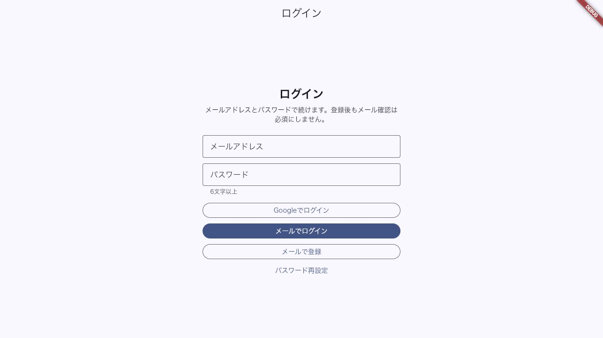

# Issue 033: PWA としてインストールできる

## 対象

- GitHub Issue: #34
- Issue 定義: [033-pwa-installable.md](../../issue/033-pwa-installable.md)
- 対象機能: Volume Fit を PWA としてインストール可能にする manifest とアイコン設定

## 自動テスト確認

- [x] アプリ名、短縮名、説明、テーマ色、背景色を manifest に設定する
- [x] `standalone` 表示とルート開始 URL を設定する
- [x] 192px / 512px の通常アイコンと maskable アイコンを設定する
- [x] HTML の title、説明、theme-color、Apple Web App 名を Volume Fit 用に設定する

## 手動確認

| No. | 操作 | 期待結果 | 結果 |
|---:|---|---|---|
| 1 | Firebase Hosting の HTTPS URL を Chrome で開く | インストール操作が利用できる | Hosting 構築後に実施 |
| 2 | インストール後にアプリを起動する | Volume Fit 名とアイコンで standalone 表示される | 未実施 |
| 3 | `http://127.0.0.1:3002/#/login` を開く | ログイン画面が表示される。HTTP のためインストール条件は満たさない | 確認済み |

## スクリーンショット

## 未実施理由

PWA のインストール条件には HTTPS と service worker を含む本番相当のビルド配信が必要である。Firebase Hosting の環境構築は後続 Issue #43 以降で行うため、HTTP の localhost では UI 表示のみを確認した。`flutter build web` の出力を静的配信して manifest 内容を確認済み。

## 実行コマンド

- `/Users/naotoyasuda/Documents/New project/horen-check/toolchains/flutter/bin/flutter test test/pwa_manifest_test.dart`
- `/Users/naotoyasuda/Documents/New project/horen-check/toolchains/flutter/bin/flutter analyze`

## 対象外

- Firebase Hosting への HTTPS 配備
- iOS Safari の実機インストール確認
- オフライン時のデータ同期と更新通知。後続 PWA Issue で対応する
