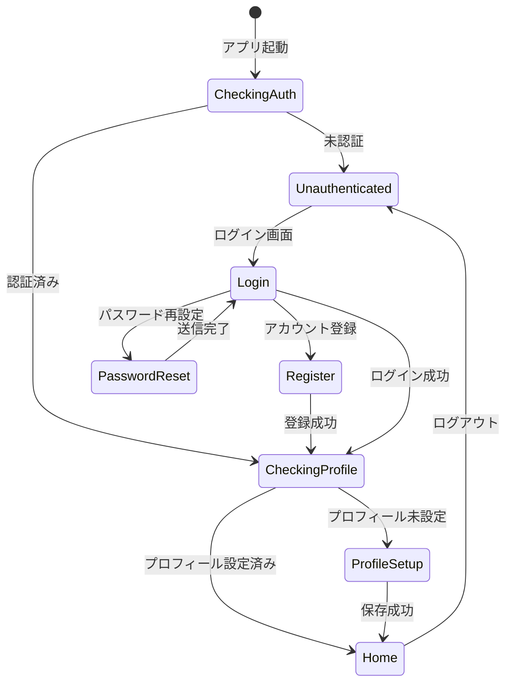
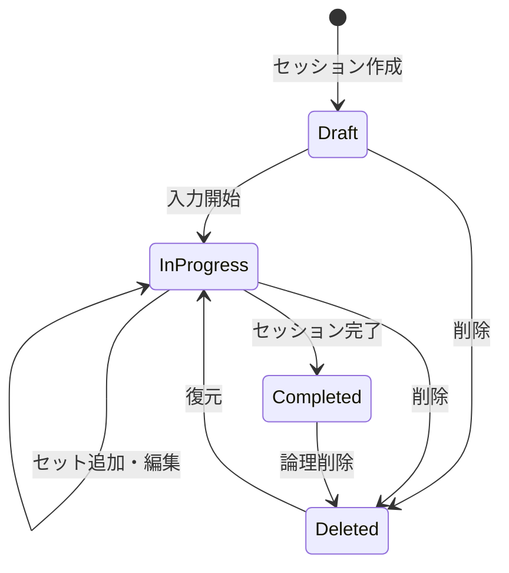
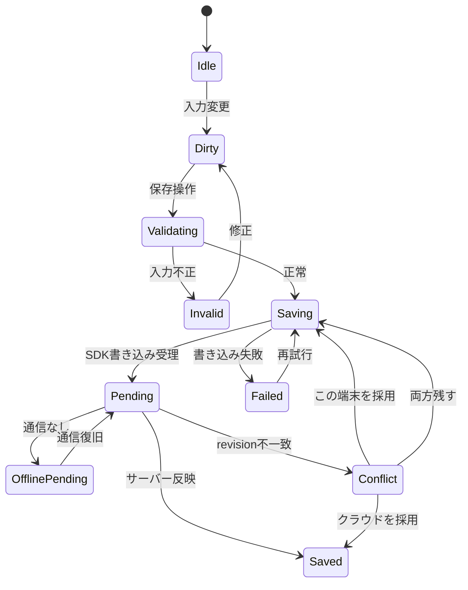
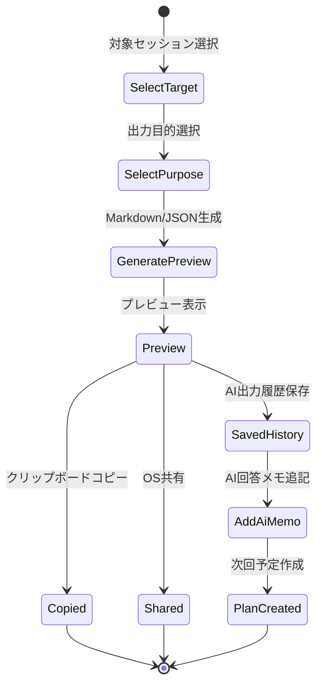
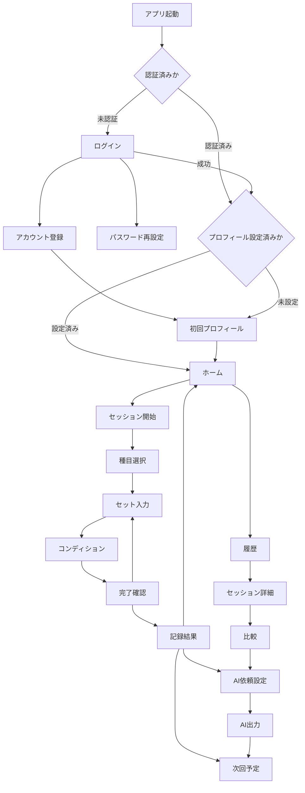

# 状態遷移図

## 認証・初回プロフィール

```mermaid
stateDiagram-v2
    [*] --> CheckingAuth: アプリ起動
    CheckingAuth --> Unauthenticated: 未認証
    CheckingAuth --> CheckingProfile: 認証済み

    Unauthenticated --> Login: ログイン画面
    Login --> Register: アカウント登録
    Login --> PasswordReset: パスワード再設定
    Register --> CheckingProfile: 登録成功
    Login --> CheckingProfile: ログイン成功
    PasswordReset --> Login: 送信完了

    CheckingProfile --> ProfileSetup: プロフィール未設定
    CheckingProfile --> Home: プロフィール設定済み
    ProfileSetup --> Home: 保存成功

    Home --> Unauthenticated: ログアウト
```

## セッション状態

```mermaid
stateDiagram-v2
    [*] --> Draft: セッション作成
    Draft --> InProgress: 入力開始
    InProgress --> InProgress: セット追加・編集
    InProgress --> Completed: セッション完了
    Draft --> Deleted: 削除
    InProgress --> Deleted: 削除
    Completed --> Deleted: 論理削除
    Deleted --> InProgress: 復元
```

## 保存状態管理

```mermaid
stateDiagram-v2
    [*] --> Idle

    Idle --> Dirty: 入力変更
    Dirty --> Validating: 保存操作
    Validating --> Invalid: 入力不正
    Invalid --> Dirty: 修正

    Validating --> Saving: 正常
    Saving --> Pending: SDK書き込み受理
    Pending --> Saved: サーバー反映
    Pending --> OfflinePending: 通信なし

    OfflinePending --> Pending: 通信復旧
    Saving --> Failed: 書き込み失敗
    Failed --> Saving: 再試行

    Pending --> Conflict: revision不一致
    Conflict --> Saving: この端末を採用
    Conflict --> Saved: クラウドを採用
    Conflict --> Saving: 両方残す
```

## AI 出力フロー

```mermaid
stateDiagram-v2
    [*] --> SelectTarget: 対象セッション選択
    SelectTarget --> SelectPurpose: 出力目的選択
    SelectPurpose --> GeneratePreview: Markdown/JSON生成
    GeneratePreview --> Preview: プレビュー表示
    Preview --> Copied: クリップボードコピー
    Preview --> Shared: OS共有
    Preview --> SavedHistory: AI出力履歴保存
    SavedHistory --> AddAiMemo: AI回答メモ追記
    AddAiMemo --> PlanCreated: 次回予定作成
    Copied --> [*]
    Shared --> [*]
    PlanCreated --> [*]
```

## メイン画面遷移

```mermaid
flowchart TD
    START[アプリ起動]
    AUTH{認証済みか}
    LOGIN[ログイン]
    REGISTER[アカウント登録]
    RESET[パスワード再設定]
    PROFILE_CHECK{プロフィール設定済みか}
    PROFILE[初回プロフィール]
    HOME[ホーム]

    SESSION[セッション開始]
    EXERCISE[種目選択]
    SET[セット入力]
    CONDITION[コンディション]
    CONFIRM[完了確認]
    RESULT[記録結果]

    HISTORY[履歴]
    DETAIL[セッション詳細]
    COMPARE[比較]
    AI_CONFIG[AI依頼設定]
    AI_PREVIEW[AI出力]
    PLAN[次回予定]

    START --> AUTH
    AUTH -->|未認証| LOGIN
    AUTH -->|認証済み| PROFILE_CHECK

    LOGIN --> REGISTER
    LOGIN --> RESET
    LOGIN -->|成功| PROFILE_CHECK

    REGISTER --> PROFILE
    PROFILE_CHECK -->|未設定| PROFILE
    PROFILE_CHECK -->|設定済み| HOME
    PROFILE --> HOME

    HOME --> SESSION
    SESSION --> EXERCISE
    EXERCISE --> SET
    SET --> CONDITION
    CONDITION --> CONFIRM
    CONFIRM --> SET
    CONFIRM --> RESULT

    RESULT --> AI_CONFIG
    RESULT --> PLAN
    RESULT --> HOME

    HOME --> HISTORY
    HISTORY --> DETAIL
    DETAIL --> COMPARE
    COMPARE --> AI_CONFIG
    AI_CONFIG --> AI_PREVIEW
    AI_PREVIEW --> PLAN
```
